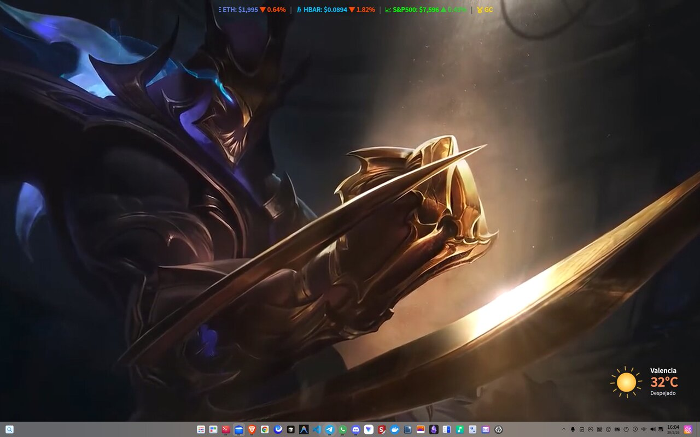
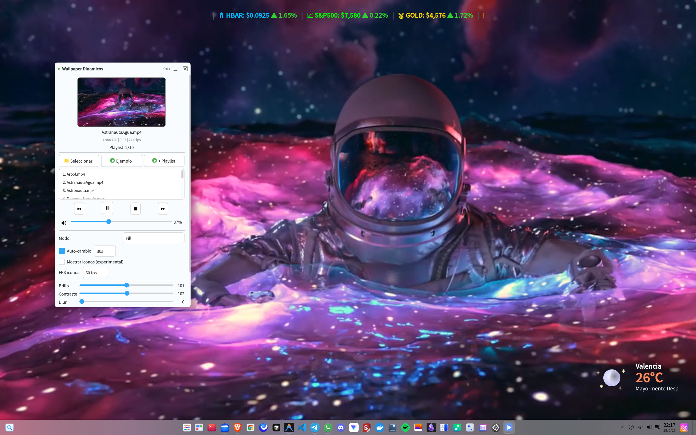

# Wallpapers Dynamics

> **ES:** Reproductor de video como fondo de pantalla animado para Linux. Compatible con X11 y Wayland.  
> **EN:** Animated video wallpaper player for Linux. Compatible with X11 and Wayland.




---

## 📦 Descarga rápida / Quick download

**ES:** Descarga el paquete `.deb` desde [GitHub Releases](https://github.com/yhas1984/Wallpapers_Dynamics/releases) e instala:

**EN:** Download the `.deb` package from [GitHub Releases](https://github.com/yhas1984/Wallpapers_Dynamics/releases) and install:

```bash
curl -LO https://github.com/yhas1984/Wallpapers_Dynamics/releases/download/v1.1.0/wallpaper-dinamicos-1.1.0.deb
sudo dpkg -i wallpaper-dinamicos-1.1.0.deb
sudo apt install -f
# Run: wallpaper-dinamicos
```

---

## Características / Features

| ES | EN |
|----|----|
| **Video como wallpaper** — reproduce MP4, WebM, MKV, AVI, MOV como fondo de escritorio | **Video wallpaper** — plays MP4, WebM, MKV, AVI, MOV as desktop background |
| **Dos modos**: mpv embebido (X11, fluido) o frames vía D-Bus (X11/Wayland, con iconos) | **Two modes**: embedded mpv (X11, smooth) or D-Bus frames (X11/Wayland, with icons) |
| **Detección NVIDIA** → `--gpu-api=vulkan` + `--vo=gpu-next` + `--hwdec=auto` | **NVIDIA detection** → Vulkan render, GPU decoding |
| **Filtros en vivo**: brillo, contraste, blur (vía IPC mpv, sin reiniciar) | **Live filters**: brightness, contrast, blur (via mpv IPC, no restart) |
| **Escala en vivo**: Fill / Fit / Stretch / Center (cambio instantáneo sin reinicio) | **Live scale**: Fill / Fit / Stretch / Center (instant switch, no restart) |
| **Velocidad ajustable**: 0.25×–2× (slider en la UI) | **Speed control**: 0.25×–2× (UI slider) |
| **Playlist** con auto-avance (5s–3600s) | **Playlist** with auto-advance (5s–3600s) |
| **FPS configurables** 10–180 para modo iconos | **Configurable FPS** 10–180 for icon mode |
| **Volumen**, mute, atajos de teclado | **Volume**, mute, keyboard shortcuts |
| **Pausa automática** en pantalla completa o maximizada (X11 EWMH) | **Auto-pause** on fullscreen or maximized windows (X11 EWMH) |
| **Pausa al bloquear** la pantalla (D-Bus SessionManager) | **Pause on screen lock** (D-Bus SessionManager) |
| **Pausa por inactividad** (cursor quieto, configurable 10s–600s) | **Idle pause** (cursor still, configurable 10s–600s) |
| **Drag & Drop** de videos | **Drag & Drop** videos |
| **Inicio minimizado** en la bandeja | **Start minimized** to system tray |
| **Tema adaptable** (oscuro/claro) | **Adaptive theme** (dark/light) |
| **Cross-desktop**: Deepin, KDE, GNOME, XFCE, Cinnamon (X11 + Wayland) | **Cross-desktop**: Deepin, KDE, GNOME, XFCE, Cinnamon (X11 + Wayland) |
| **No inhibe suspensión** del sistema | **Does not prevent** system suspend |
| **Auto-inicio** con la sesión | **Auto-start** with session |
| **PyQt6** con QSS moderno | **PyQt6** with modern QSS |

---

## Modos de funcionamiento / Modes

### Modo normal / Normal mode (no icons)

**ES:** Usa mpv incrustado en una ventana X11 (OpenGL/Vulkan). Video fluido a fps nativos, con filtros (brillo, contraste, blur), velocidad ajustable, modos de escala, audio y controles completos. Incluye detección automática de NVIDIA para renderizado Vulkan. Pausa automática en pantalla completa, bloqueo de pantalla o inactividad.

**EN:** Uses mpv embedded in an X11 window (OpenGL/Vulkan). Smooth video at native fps, with filters (brightness, contrast, blur), adjustable speed, scale modes, audio and full controls. Includes NVIDIA auto-detection for Vulkan rendering. Auto-pause on fullscreen, screen lock, or idle.

### Modo iconos / Icon mode (cross-desktop, X11 + Wayland)

**ES:** Extrae frames con ffmpeg y los pone como wallpaper del escritorio según el DE detectado. Los iconos quedan visibles. Sin audio/filtros. FPS 10–180. Soporta X11 y Wayland de forma nativa. Backends usados: `gsettings` (Deepin, GNOME, Cinnamon), `xfconf-query` (XFCE), `plasma-apply-wallpaperimage` (KDE). En Wayland la app se auto-configura en este modo (mpv embebido no es posible en Wayland).

**EN:** Extracts frames with ffmpeg and sets them as the desktop wallpaper according to the detected DE. Desktop icons remain visible. No audio/filters. FPS 10–180. Supports X11 and Wayland natively. Backends used: `gsettings` (Deepin, GNOME, Cinnamon), `xfconf-query` (XFCE), `plasma-apply-wallpaperimage` (KDE). On Wayland the app auto-configures to this mode (embedded mpv is not possible in Wayland).

### Soporte Wayland / Wayland support

**ES:** La app detecta automáticamente si está corriendo en X11 o Wayland. En Wayland **solo** se usa el modo de extracción de frames (mpv no puede embeberse en Wayland). En X11 se usan ambos modos según preferencia. La detección de pantalla completa via EWMH solo funciona en X11; en Wayland esa función se desactiva.

**EN:** The app auto-detects whether it's running in X11 or Wayland. On Wayland only frame extraction is used (mpv cannot embed in Wayland). On X11 both modes are available. Fullscreen detection via EWMH only works on X11; on Wayland this feature is disabled.

---

## Requisitos / Requirements

- **Sistema/System:** Linux con/with X11 o Wayland
- **Python:** 3.9+

```bash
# Debian/Ubuntu/Deepin
sudo apt install mpv ffmpeg libnotify-bin python3-pyqt6 python3-xlib python3-dbus

# Arch
sudo pacman -S mpv ffmpeg libnotify python-pyqt6 python-xlib python-dbus

# Fedora
sudo dnf install mpv ffmpeg libnotify python3-qt6 python3-xlib python3-dbus
```

---

## Instalación / Installation

### Desde .deb (recomendado / recommended)

```bash
curl -LO https://github.com/yhas1984/Wallpapers_Dynamics/releases/download/v1.1.0/wallpaper-dinamicos-1.1.0.deb
sudo dpkg -i wallpaper-dinamicos-1.1.0.deb
sudo apt install -f
wallpaper-dinamicos
```

### Desde código fuente / From source

```bash
git clone https://github.com/yhas1984/Wallpapers_Dynamics.git
cd Wallpapers_Dynamics
pip install -r requirements.txt --break-system-packages
python3 run.py
```

### Ejecutable standalone / Standalone binary

```bash
pyinstaller wallpaper-dinamicos.spec --noconfirm
./dist/wallpaper-dinamicos
```

---

## Uso / Usage

**ES:** La app inicia minimizada en la bandeja. Haz clic en el icono para abrir. Arrastra un video o haz clic en "Seleccionar". Para cerrar a la bandeja, solo cierra la ventana.

**EN:** The app starts minimized to the system tray. Click the tray icon to open. Drag a video or click "Select". Close the window to minimize to tray.

Para iniciar con la ventana visible / To start with visible window:
```bash
# Editar ~/.config/wallpaper-dinamicos/config.json
# Cambiar "start_minimized": true → false
```

---

## Configuración / Configuration

`~/.config/wallpaper-dinamicos/config.json`

| Key | Type | Default | Description |
|-----|------|---------|-------------|
| `last_video` | string | `""` | Último video / Last video |
| `muted` | bool | `true` | Silencio / Muted |
| `volume` | int | `50` | Volumen (0–100) |
| `brightness` | int | `100` | Brillo (0–200) |
| `contrast` | int | `100` | Contraste (0–200) |
| `saturation` | int | `100` | Saturación (0–200) |
| `blur` | int | `0` | Desenfoque (0–20) |
| `speed` | float | `1.0` | Velocidad (0.25–2.0) |
| `playback_mode` | string | `"fill"` | Modo: fill/fit/stretch/center |
| `playlist` | array | `[]` | Lista de videos / Video list |
| `auto_advance` | bool | `false` | Avance automático / Auto-advance |
| `auto_advance_seconds` | int | `30` | Intervalo (5–3600) |
| `pause_on_fullscreen` | bool | `true` | Pausar en fullscreen |
| `pause_on_lock` | bool | `true` | Pausar al bloquear |
| `pause_on_idle` | bool | `false` | Pausar en inactividad |
| `idle_seconds` | int | `30` | Tiempo inactividad (10–600s) |
| `autostart` | bool | `false` | Iniciar con sesión / Start with session |
| `show_icons` | bool | `false` | Modo iconos (Deepin/Wayland siempre activo) |
| `frame_fps` | int | `30` | FPS modo iconos (10–180) |
| `start_minimized` | bool | `true` | Inicio minimizado / Start minimized |

---

## Estructura del proyecto / Project structure

```
├── run.py                      # Entry point
├── requirements.txt            # Python dependencies
├── wallpaper-dinamicos.spec    # PyInstaller config
├── screenshot.jpg / screenshot1.jpg  # Screenshots
├── build-deb/                  # .deb packaging
├── src/
│   ├── __init__.py             # Config (JSON)
│   ├── detector.py             # Desktop/display/theme detection
│   ├── wallpaper_engine.py     # WallpaperEngine (mpv) + FrameWallpaperEngine (D-Bus)
│   ├── tray_app.py             # GUI (PyQt6), tray, playlist, QSS
│   ├── utils.py                # Video metadata, notifications, thumbnails
│   └── icons.py                # Programmatic vector icons
└── samples/                    # Sample videos
```

---

## Changelog

### v1.1.0 — Wayland support (2026-06-01)

**ES:**
- **Soporte Wayland** con auto-detección: en Wayland se usa solo el modo de extracción de frames
- **FrameWallpaperEngine** ahora es cross-desktop con backends por DE:
  - `gsettings` (Deepin, GNOME, Cinnamon)
  - `plasma-apply-wallpaperimage` (KDE)
  - `xfconf-query` (XFCE)
- **Inits de X11 protegidos**: imports de Xlib movidos a lazy, `WallpaperEngine` con `init_window=False` por defecto, captura de excepciones
- **Checkbox "Mostrar iconos"** visible en todos los DEs (no solo Deepin) cuando se detecta Wayland
- **Bloqueo de cambio a mpv** en Wayland o cuando X11 no está disponible

**EN:**
- **Wayland support** with auto-detection: on Wayland only frame extraction mode is used
- **FrameWallpaperEngine** is now cross-desktop with per-DE backends:
  - `gsettings` (Deepin, GNOME, Cinnamon)
  - `plasma-apply-wallpaperimage` (KDE)
  - `xfconf-query` (XFCE)
- **X11 init hardening**: Xlib imports moved to lazy loading, `WallpaperEngine` defaults to `init_window=False`, exception capture
- **"Show icons" checkbox** visible in all DEs (not just Deepin) when Wayland is detected
- **mpv switch blocked** on Wayland or when X11 is unavailable

### v1.0.3 — Bug fixes (2026-05-31)

- Fix `prerm` que mataba dpkg durante install/remove (`pkill -f` → `pkill -x`)
- Detección automática de GPU NVIDIA → `--gpu-api=vulkan` + `--vo=gpu-next`
- Slider de velocidad 0.25×–2× en UI
- Detección de inactividad con pausa configurable
- Estado de pausa centralizado (manual + fullscreen + lock + idle)

### v1.0.0–v1.0.2

- Modo mpv embebido (X11) con filtros, velocidad, escala
- Modo frames (D-Bus) para Deepin con iconos visibles
- Detección de pantalla completa via EWMH
- Pausa al bloquear pantalla
- Drag & Drop, playlist, auto-avance

---

## Solución de problemas / Troubleshooting

| ES | EN |
|----|----|
| **En Wayland: solo modo iconos** (mpv no funciona) — es por diseño | **On Wayland: only icon mode** (mpv not supported) — by design |
| **No detecta Wayland** → verificar `echo $XDG_SESSION_TYPE` debe ser `wayland` | **Wayland not detected** → check `echo $XDG_SESSION_TYPE` should be `wayland` |
| **GNOME/KDE/XFCE en Wayland: ¿funciona?** → Sí, modo iconos automático | **GNOME/KDE/XFCE on Wayland: does it work?** → Yes, automatic icon mode |
| **El video no se muestra** → ejecuta desde terminal para ver errores | **Video not showing** → run from terminal to see errors |
| **No suspende** → `--stop-screensaver=no` ya configurado | **System won't suspend** → `--stop-screensaver=no` already set |
| **Iconos no visibles** → Deepin V23+ con dde-shell, subir FPS | **Icons not visible** → Deepin V23+ with dde-shell, increase FPS |
| **No restaura desde bandeja** → clic simple (no doble) en Deepin | **Won't restore from tray** → single click (not double) on Deepin |
| **"cannot connect to X server"** → ejecutar desde sesión gráfica | → run from a graphical session |
| **Error PyQt6** → `sudo apt install python3-pyqt6` | → install PyQt6 system package |
| **KDE Wayland: wallpaper no cambia** → verificar `plasma-apply-wallpaperimage` instalado | **KDE Wayland: wallpaper not changing** → check `plasma-apply-wallpaperimage` installed |

---

## Licencia / License

MIT
